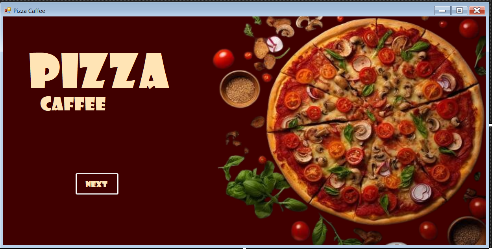
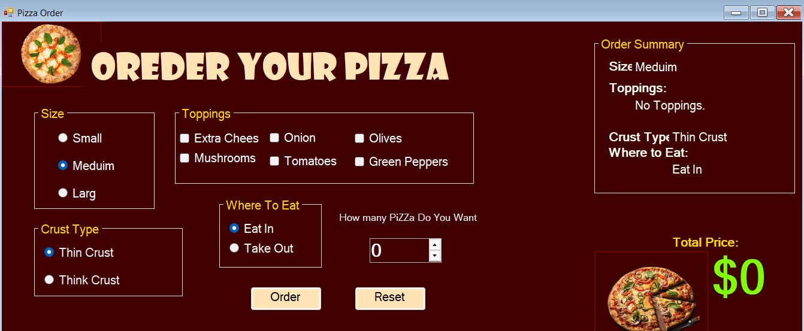

# 🍕 Pizza Management System

A desktop application built using **C# Windows Forms** that allows users to customize and place pizza orders through a simple and interactive graphical interface.

---

## ✨ Features

- 🍕 Choose pizza size (Small, Medium, Large)
- 🧀 Select crust type (Thin, Thick)
- 🥓 Add multiple toppings
- 🚚 Delivery or Takeaway options
- 💰 Automatic total price calculation
- 🔄 Reset order
- ✅ Order confirmation

---

## 🛠️ Technologies Used

- C#
- Windows Forms (.NET Framework)
- Visual Studio

---

## 🎯 Learning Objectives

This project helped me practice:

- Windows Forms development
- Event-driven programming
- Object-Oriented Programming (OOP)
- Working with CheckBox, RadioButton, GroupBox, and Buttons
- Designing graphical user interfaces
- Writing clean and organized C# code

---

## 📸 Screenshots

### 🏠 Main Form



### 📝 Order Form



---

## 🚀 How to Run

1. Clone the repository:

```bash
git clone https://github.com/moe-stack24x/Pizza-Management-System.git
```

2. Open the solution in **Visual Studio**.

3. Build and run the project.

---

## 👨‍💻 Author

**Mohamed Idris**

- GitHub: https://github.com/moe-stack24x
